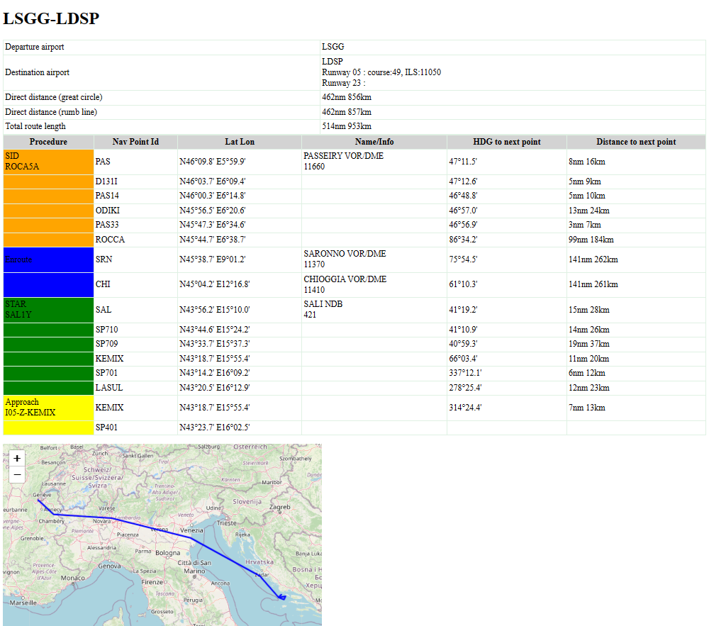

# NavMe-CLI
NavMe-CLI is a command line to help the flight planning with a **simulator** like X-Plane. It
uses the [NavMe-LIB](https://github.com/norberttak/NavMe-lib) package.


## Installation
Unzip the package to anywhere on your computer. The only thing you
have to do before start using the package is to edit the configuration file.  
## Configuration File
NavMe-CLI has a configuration file for basic settings. The config file is the **navme-cli.ini**
It has key-value pairs like other ini files.
```ini
XPLANE_ROOT=C:\X-Plane 12
ANGLE_FORMAT=ANGLE_DEG_DECMIN
LOG_LEVEL=INFO
```
Please double check the first element (XPLANE_ROOT) is the valid path to your XPlane's root folder.

The ANGLE_FORMAT is to control the string representation of the angles. The possible values are:

|ANGLE_FORMAT|Description|Example|
|----------------|--------|----------------|
|ANGLE_DEG_DECMIN|use degree and minutes in decimal format. The decimal part is always 1 digit long|47°25.2'|
|ANGLE_DEG_MIN_SEC|use degree, minutes and seconds|47°25'14"|
|ANGLE_DOUBLE|angle value is display as a double|47.42|

The LOG_LEVEL is to control the details of log messages recorded in the nav-me-lib-log.txt file.

Possible option values:
- TRACE
- DEBUG
- INFO
- WARNING
- ERROR

The TRACE has the most detailed log level but it can generate huge log file. Use this only in case of detailed debugging.

The configuration values can also be set during runtime. see details in [set_option](#set_option).
## Navigation data source
It uses the navigation data of your XPlane simulator. It parses the navigation data at startup time.
The files being parsed are:
- Custom Data/earth_fix.dat
- Custom Data/earth_nav.dat
- Custom Data/CIFP/*.dat (on demand, if need info about an airport)

If you want to use the NaveME-CLI on other computer you can copy the above files from your XPlane (keep the directory structure)
to the other computer and edit the navme-cli.ini file to set the XPLANE_ROOT option.

## Command References

### set commands
These commands are created to set either an option or part of your flight (RNAV procedures)
#### set dep
Set departure airport. Use the ICAO id of the airport.

```
# set dep lhbp
departure airport: LHBP
  name: , region: LH
  magnetic variation: 5°00.0'
  N47°25.2' E19°17.8'
  ```
#### set dest
Set destination airport. Use the ICAO id of the airport.

```
# set dest epwa
destination airport: EPWA
  name: , region: EP
  magnetic variation: 6°00.0'
  N52°05.6' E20°35.0'
  ```
#### set sid
Set SID (Standard Instrumental Departure) to your flight plan.

```
# set sid litk2b
SID: LITK2B
  DE13L:N47°25.3' E19°17.6'
  BP701:N47°23.2' E19°23.0'
  BP702:N47°35.2' E19°43.1'
  BP703:N47°47.3' E19°23.7'
  BP705:N47°56.2' E19°36.0'
  LITKU:N48°13.8' E19°35.9'
```
The command finds all the navigation points of the SID and add it to your flight plan.

#### set star
Set STAR (STandard Arrival Route) to your flight plan.
```
# set star LOGD5N
STAR: LOGD5N
  LOGDA:N51°17.0' E20°41.6'
  WA821:N51°28.9' E20°47.9'
  EMCEL:N51°41.1' E20°54.5'
  FOLFA:N51°46.6' E20°57.4'
  SERFU:N51°56.2' E20°58.1'
  FILOZ:N52°04.2' E20°58.7'
  SOSIN:N52°07.3' E20°47.5'
  BASEK:N52°10.7' E20°35.3'
  LUGEL:N52°12.4' E20°29.4'
  PIBAR:N52°14.0' E20°23.5'
  WA413:N52°18.5' E20°26.8'
  WA412:N52°16.9' E20°32.7'
  ```

The command finds all the navigation points of the STAR and add it to your flight plan.
#### set app{#set_app}
Set the Approach procedure for the arrival airport. The name of the procedure
shall contain the transition point name with "-". See the [list app](#list_app) command.
```
# set app I31R-NICRA
APP: I31R-NICRA
  NICRA:N47°21.3' E19°34.9'
  BP865:N47°17.6' E19°29.9'
  ```
#### set option {#set_option}
set option key-value pair to a new value. Please note: this change won't be saved to
the navme-cli.ini file and changes will lost when you exit the application. If you 
to set an option permanently please edit the navme-cli.ini.

```# set option ANGLE_FORMAT ANGLE_DEG_MIN_SEC```

### show commands
Show commands are created for display information about navigation points in the databes.
#### show direct
Show the distance and bearing between any two navigation points (airports, vor, ndb, etc) in the database.
It calculate the distance and bearings in both great circle (orthodrom) and rhumb line (loxodrom) as well.

```
# show direct lhbp kjfk
loxodrom (rhumb line) route:
  heading -83°58.8'
  distance 7460.96 km   4028 nm
orthodrom (great circle) route:
  departure heading 58°32.0'  arrival heading 130°44.5'
  distance 7018.95 km   3789 nm
```

#### show info
Show detailed info about any navigation points in the database or details of your flight plan.
```
# show info ptb
Nav point: PTB LH N47°09.1' E18°44.5'
  VOR+DME: 11710 MHz
  PUSZTASZABOLCS VOR/DME
  magnetic variation: 5°00.0'
  elevation: 430 ft
```

#### show flight_plan
Show the complete flight plan you created previously with the set commands.
If you need a more fancy output format check the [export flightplan](#export_filghtplan) command.
```
# show flight_plan
#########################################
departure:  LSGG
destination:LDSP
direct distance orthodrom: 856 km, 462 nm
direct distance loxodrom: 857 km, 462 nm
#########################################
sid: ROCA5A RW22
    PAS N46°09.8' E5°59.9'
    PAS N46°09.8' E5°59.9'
  D131I N46°03.7' E6°09.4'
  PAS14 N46°00.3' E6°14.8'
  ODIKI N45°56.5' E6°20.6'
  PAS33 N45°47.3' E6°34.6'
  ROCCA N45°44.7' E6°38.7'
enroute:
    CHI N45°04.2' E12°16.8'
    SRN N45°38.7' E9°01.2'
star: SAL1Y RW23
    SAL N43°56.2' E15°10.0'
  SP710 N43°44.6' E15°24.2'
  SP709 N43°33.7' E15°37.3'
  KEMIX N43°18.7' E15°55.4'
  SP701 N43°14.2' E16°09.2'
  LASUL N43°20.5' E16°12.9'
approach: I31R-NICRA
  NICRA N47°21.3' E19°34.9'
  BP865 N47°17.6' E19°29.9'
```

#### show metar
This command fetches the actual METAR from AVWX services. Use the icao 
id of airport as a parameter:
```
# show metar lhbp
LHBP 271800Z 08006G16KT 050V120 CAVOK M00/M06 Q1024 NOSIG
```
This command requires an API token from the AVWX web site. See the details in [token registration](doc/api-token-registration.md).

[Api Token Registration](doc/api-token-registration.md)#### show taf
This command fetches the actual TAF from AVWX services. Use the icao 
id of airport as a parameter:
```
# show taf egll
EGLL 271654Z 2718/2824 02009KT 9999 SCT035 TEMPO 2721/2811 BKN012 PROB30 TEMPO 2800/2807 BKN005 PROB30 TEMPO 2813/2821 8000 SHRA BKN014
```
This command requires an API token from the AVWX web site. See the details in [token registration](doc/api-token-registration.md).

### export command
#### export flight_plan{#export_flightplan}
Export the flight plan in html format.
```
# export flight_plan
flight plan exported: export/LSGG-LDSP.html
```

The html file will be created in the export folder. The default name of the file is 
departure_icao-destination_icao.html. If you want to set other file name use the ```--file <file_name>``` option.



### list commands
The list commands can list RNAV procedures for any airports.

#### list sid
List SID procedures for the airport specified with its ICAO code. If you don't add
airport ICAO code it will use your departure airport (if set) by default.
```
# list sid epwa
BAMS5K RW33
BAMS6A RW11
BAMS6D RW15
BAMS6G RW29
EVIN4K RW33
EVIN5A RW11
EVIN5D RW15
EVIN7G RW29
LOLS5K RW33
LOLS6A RW11
LOLS6D RW15
LOLS7G RW29
OLIL5D RW15
OLIL5K RW33
OLIL6A RW11
OLIL6G RW29
SOXE5K RW33
SOXE6A RW11
SOXE6D RW15
SOXE7G RW29
XIMB4K RW33
XIMB5A RW11
XIMB6D RW15
XIMB7G RW29
```
It will show you the departing runways for each SID procedures.

#### list star
List STAR procedures for the airport specified with its ICAO code. If you don't add
airport ICAO code it will use your destination airport (if set) by default.

```
# list star lhbp
ANEX2H RW31B
ANEX2T RW13B
ARFO2H RW31B
ARFO2T ALL
BETE2H RW31B
BETE2T RW13B
EBAM2H RW31B
EBAM2T RW13B
EDEM2H RW31B
EDEM2T ALL
KEZA2H RW31B
KEZA2T RW13B
ULZA2H RW31B
ULZA2T RW13B
VAJD2H RW31B
VAJD2T RW13B
```
It will show you the arriving runways for each STAR procedures.

#### list app {#list_app}
List Approach procedures for the airport specified with its ICAO code. If you don't add
airport ICAO code it will use your destination airport (if set) by default.

```
# list app lhdc
I04R-DC1
Q22L-DC
R04R-DC001
R04R-DC031
R04R-DC032
R22L-DC001
```
The approach procedure names contain the transition point name as well. When you use the [set app](#set_app) command please use the
 whole name printed by this command (including the transition point).

### route commands
The route commands are created to add and remove enroute points to your flight plan.
#### route add
This command will append the listed nav points to your enroute points.
If the database contains multiple instances for the name (very common for VOR and NDB points) it will list all possible 
points to you and ask you to specify the ICAO region code.
```
# route add chi
  id:CHI name:CHANGHAI VOR/DME region:ZY
  id:CHI name:CHIOGGIA VOR/DME region:LI
  id:CHI name:CHILLARKI VOR/DME region:VI
  id:CHI name:CHILLAN VOR/DME region:SC
multiple nav points found. please specify region code:
? li
#
```
In this example I choose the LI region code.

You can put as many navigation points to the list. It will automaticaly skip the
 DCT and airway identifications. It's very convenient to copy and paste the enroute points from simbrief or skyvector.

#### route insert
The route insert command works similary than the route add except it will insert the new navigation points into your enroute list.
You can define the insert position by the --before or --after option. The index shall be a 0 based index counted for the enroute list (don't take into account the SID or other RNAV proc points).
```
# show flight_plan
#########################################
departure:  LSGG
destination:LDSP
direct distance orthodrom: 856 km, 462 nm
direct distance loxodrom: 857 km, 462 nm
#########################################
enroute:
    SRN N45°38.7' E9°01.2'
    CHI N45°04.2' E12°16.8'

# route insert --after 0 uvnon


# show flight_plan
#########################################
departure:  LSGG
destination:LDSP
direct distance orthodrom: 856 km, 462 nm
direct distance loxodrom: 857 km, 462 nm
#########################################
enroute:
    SRN N45°38.7' E9°01.2'
  UVNON N45°16.9' E10°53.5'
    CHI N45°04.2' E12°16.8'
```
In the above example I inserted a new point (UVNON) after the first (0 index) nav point (which is SRN). You can 
see the result after the show flight_plan command.

This command also accepts multiple navigation point ids in the parameter list.

#### route remove
This command is for remove any points from your enroute list. As a parameter you shall add an index (zero based) or an index range
```
route remove 0
```
This removes the first enroute point from the flight plan.

```
route remove 3:6
```
This removes all the enroute points between index 3 and 6.