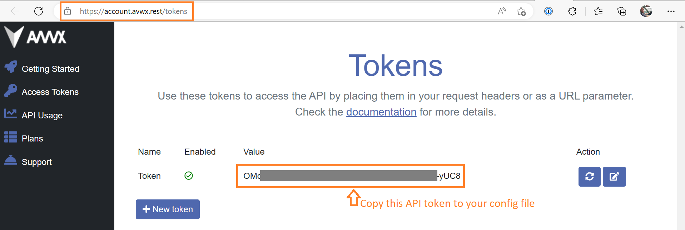
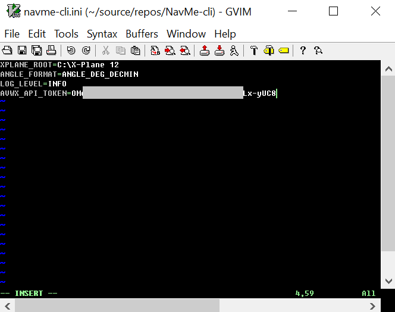

# API token registration at AVWX Weather service

The http://avwx.rest is a web service provides METAR and TAF reports. It requires an API token
which can be created on the web site. Please follow these steps:
1. If you don't have an account create one [here](https://account.avwx.rest/register). The free account allows you to do 4000 queries per day.
2. Go to the [token page](https://account.avwx.rest/tokens) and press the **+New token** button. 
3. Copy the generated API token string into the navme-cli.ini config file and add it to the AVWX_API_TOKEN=XXXXX section (replace XXXXX with your api token) 

